class: center, middle


# Introduction to Machine Learning
### Raphael Cobe
### Advanced Institute for Artificial Intelligence
### June, 2019

---
class: center, middle


# http://advancedinstitute.ai

```{r setup, include=FALSE}
options(htmltools.dir.version = FALSE)
```

---
class: center middle, inverse

# Unsupervised Learning

---
class: center, middle
# Dimensionality Reduction
## Principal Component Analysis
### Why should we look at dimensionality reduction?
#### Compression and Visualization

---
class: left
# Principal Component Analysis - PCA
## Data Compression
* Speeds up algorithms
* Reduces space used by data for them
* What is dimensionality reduction?
  * So you've collected many features - maybe more than you need
    * Can you "simply" your data set in a rational and useful way?
  * Example
    * Redundant data set - different units for same attribute
    * Reduce data to 1D (2D->1D)

---
class: left
# Principal Component Analysis - PCA
## Data Compression

* Data redundancy can happen when different teams are working independently
  * Often generates redundant data (especially if you don't control data collection)
* Another example:
* Helicopter flying - do a survey of pilots ( $x_1$ = skill, $x_2$ = pilot enjoyment) 
  * These features may be highly correlated
  * This correlation can be combined into a single attribute called aptitude (for example)
  
---
class: left
# Principal Component Analysis - PCA
## Data Compression

```{r, out.width = "400px", fig.align="center", echo=FALSE}
knitr::include_graphics("images/pca1.png")
```

---
class: left
# Principal Component Analysis - PCA
## Data Compression

```{r, out.width = "400px", fig.align="center", echo=FALSE}
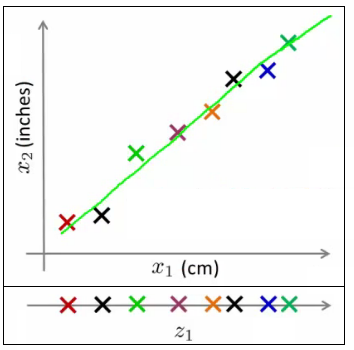
```

---
class: left
# Principal Component Analysis - PCA

* $x_1$ was a 2D feature vector (X and Y dimensions)
  * Represent $x_1$ as a 1D number (Z dimension)
* Approximate original examples
* Half the amount of storage
  * Gives lossy compression, but an acceptable loss (probably)
    * The loss above comes from the error in the measurement,
    
---
class: left
# Principal Component Analysis - PCA
## From 3D to 2D

```{r, out.width = "400px", fig.align="center", echo=FALSE}
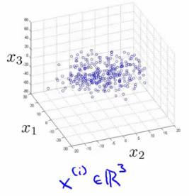
```

Maybe all the data lies in one plane.

???
* This is sort of hard to explain in 2D graphics, but that plane may be aligned with one of the axis
  * Or or may not...
* Either way, the plane is a small, a constant 3D space

---
class: left
# Principal Component Analysis - PCA
## From 3D to 2D
* Data points are sitting "inside" the blue tray (has a dark blue exterior face and a light blue inside)

```{r, out.width = "400px", fig.align="center", echo=FALSE}
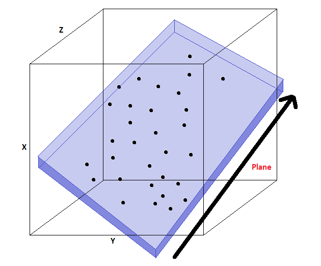
```
  
---
class: left
# Principal Component Analysis - PCA
## From 3D to 2D

* All data points in this relative shallow area
  * basically ignore one of the dimension
  * draw two new lines $z_1$ and $z_2$ along the $x$ and $y$ planes of the box
  * plot the locations in that box;

* We loose the data in the z-dimension of our "shallow box" 
  * The box is shallow it's OK to lose this. ... .red[maybe]
  
???
(NB "z-dimensions" **here refers to the dimension relative to the box** (i.e it's depth) and NOT the z dimension of the axis we've got drawn above)

---
class: left

# Principal Component Analysis - PCA
## From 3D to 2D

```{r, out.width = "600px", fig.align="center", echo=FALSE}
knitr::include_graphics("images/pca5.png")
```

---
class: left
# Principal Component Analysis - PCA
## Visualization of higher dimensional data

* It's hard to visualize highly dimensional data
  * Dimensionality reduction can improve how we display information in a tractable manner for human consumption
* Why do we care?
  * Often helps to develop algorithms if we can understand our data better
    * Seeing data in a helpful way
  * Good for explaining something to someone if you can "show" it in the data 


---
class: left
# Principal Component Analysis - PCA
## Visualization of higher dimensional data - Example

```{r, out.width = "700px", fig.align="center", echo=FALSE}
knitr::include_graphics("images/pca6.png")
```

???
Example;
* Collect a large data set about many facts of a country around the world

* x1 = GDP, ... , x6 = mean household
* Say we have 50 features per country
* How can we understand this data better?
* Very hard to plot 50 dimensional data
* Using dimensionality reduction, instead of each country being represented by a 50-dimensional feature vector

---
class: left
# Principal Component Analysis - PCA
## Visualization of higher dimensional data - Example

* Come up with a different feature representation (z values) which summarize these features

```{r, out.width = "500px", fig.align="center", echo=FALSE}
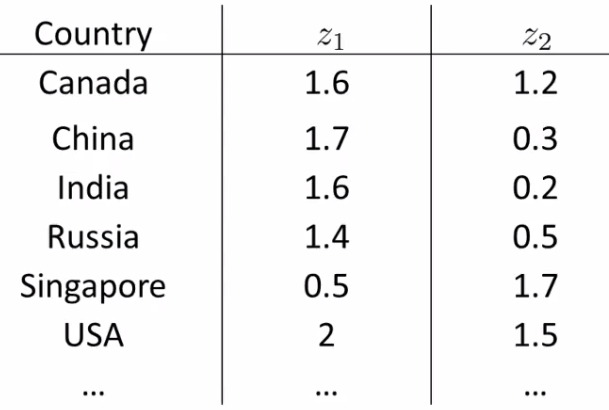
```

---
class: left
# Principal Component Analysis - PCA
## Visualization of higher dimensional data - Example

* 2-dimensional vector
  * Reduce 50D -> 2D
  * Plot as a 2D plot
* There may be **two dimensions of information**, with features associated with each of those dimensions
  * Asses what of the features can be grouped to form summary features
    * feature scaling is probably important
* Helps show the two main dimensions of variation in a way that's easy to understand

???
* Don't generally ascribe meaning to the new features (so we have to determine what these summary * values mean)
* e.g. may find horizontal axis corresponds to overall country size/economic activity
* and y axis may be the per-person well being/economic activity

---
class: left
# Principal Component Analysis - PCA
## Problem Formulation
* Say we have a 2D data set which we wish to reduce to 1D:

```{r, out.width = "500px", fig.align="center", echo=FALSE}
knitr::include_graphics("images/pca8.png")
```

---
class: left
# Principal Component Analysis - PCA
## Problem Formulation

* Find a single line onto which to project this data
* How do we determine this line?
  * The distance between each point and the projected version should be small
* Find a surface so the sum of squares onto that surface is minimized

```{r, out.width = "400px", fig.align="center", echo=FALSE}
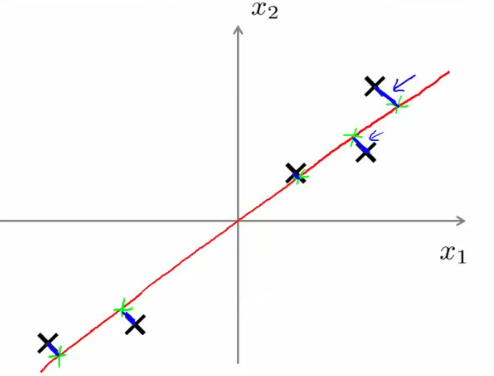
```

???
* The blue lines are sometimes called the projection error
* PCA tries to find the surface (a straight line in this case) which has the minimum projection error
* The blue lines are sometimes called the projection error
* As an aside, you should normally do mean normalization and feature scaling on your data before PCA

---
class: left
# Principal Component Analysis
## Challenge
* Use PCA method on the `Housing` dataset;
  * the data about the variables is available [here](http://archive.ics.uci.edu/ml/machine-learning-databases/housing/housing.names);
* Use the best PCA components to try to do a regression;

```{r, echo=TRUE, eval=FALSE}
houses <- read.table("http://archive.ics.uci.edu/ml/machine-learning-databases/housing/housing.data",
                     header = F, na.string = "?")
colnames(houses) <- c("CRIM", "ZN", "INDUS","CHAS","NOX",
                      "RM","AGE","DIS","RAD","TAX",
                      "PTRATIO","B","LSTAT","MEDV")
```


---
class: center, middle, inverse
# KMeans


---
class: left
#  Clustering
* Basic idea: group together similar instances
* Example: 2D point patterns 

```{r, out.width = "600px", fig.align="center", echo=FALSE}
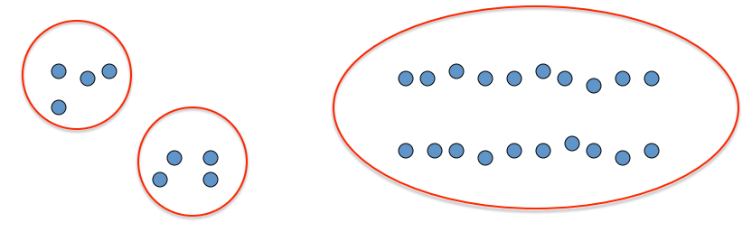
```


---
class: left
# Clustering
* What could “similar” mean?
  * One option: small Euclidean distance (squared)
  $$\operatorname{dist}(\vec{x}, \vec{y})=\|\vec{x}-\vec{y}\|_{2}^{2}$$
  * Clustering results are crucially dependent on the measure of similarity (or distance) between “points” to be clustered

---
class: left
# KMeans
* An iterative clustering algorithm
  * Initialize: Pick K random points as cluster centers
  * Alternate:
      1. Assign data points to closest cluster center
      1. Change the cluster center to the average of its assigned points
  * Stop when no pointsʼ assignments change 

.pull-left[
```{r, out.width = "300px", fig.align="center", echo=FALSE}
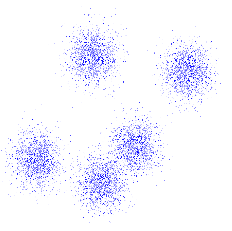
```
]

.pull-right[
```{r, out.width = "300px", fig.align="center", echo=FALSE}
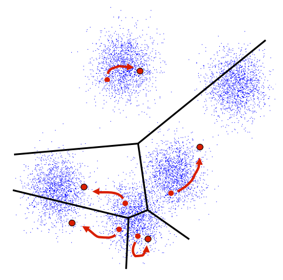
```
]

---
class: left
# KMeans

```{r, out.width = "600px", fig.align="center", echo=FALSE}
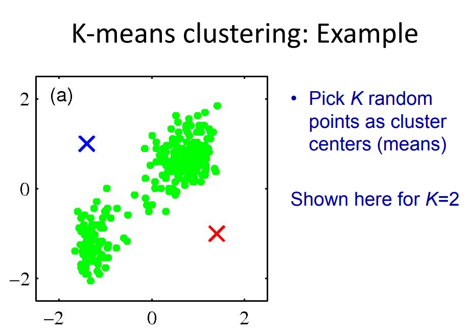
```

---
class: left
# KMeans

```{r, out.width = "600px", fig.align="center", echo=FALSE}
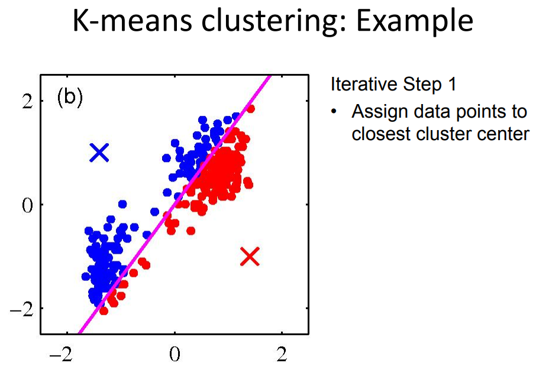
```


---
class: left
# KMeans

```{r, out.width = "600px", fig.align="center", echo=FALSE}
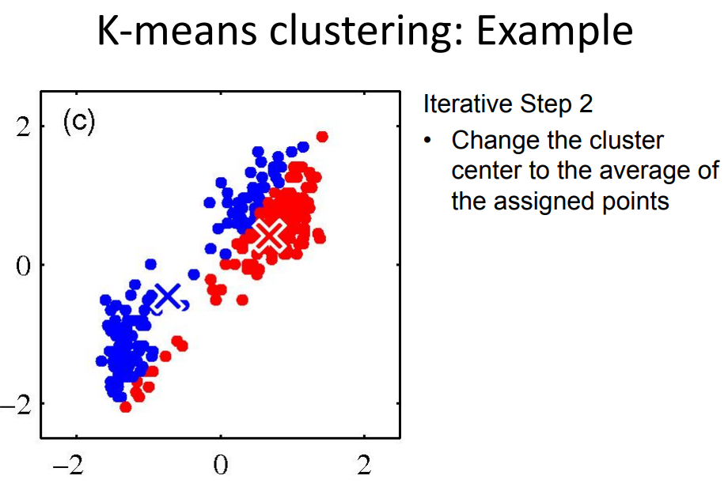
```

---
class: left
# KMeans

```{r, out.width = "600px", fig.align="center", echo=FALSE}
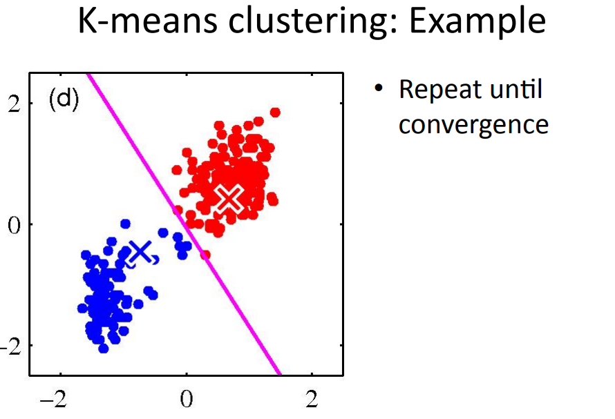
```

---
class: left
# KMeans

```{r, out.width = "600px", fig.align="center", echo=FALSE}
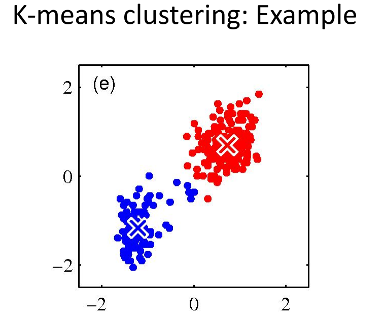
```

---
class: left
# KMeans

```{r, out.width = "600px", fig.align="center", echo=FALSE}
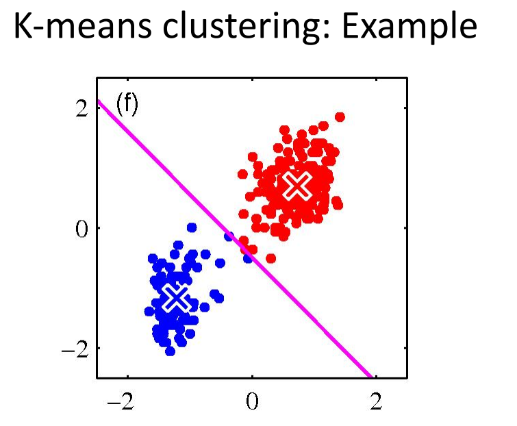
```

---
class: left
# KMeans

```{r, out.width = "600px", fig.align="center", echo=FALSE}
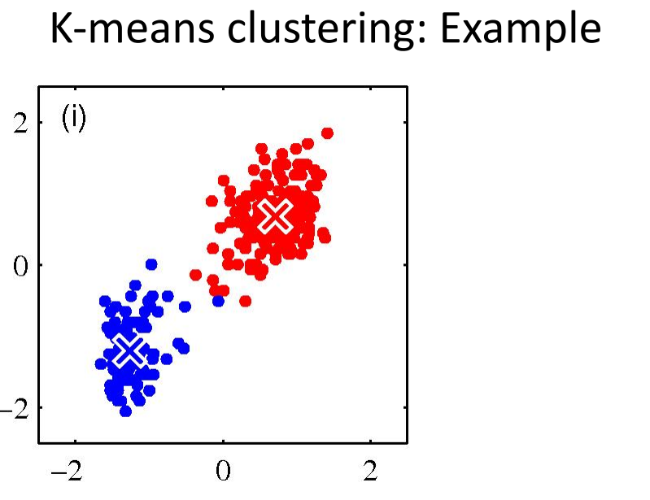
```


---
class: left
# KMeans
## Properties
* Guaranteed to converge in a finite number of iterations;
* Running time per iteration:
  * Assign data points to closest cluster center
    * $O(kn)$ time
  * Change the cluster center to the average of its assigned points
    * $O(n)$

---
class: left
# Kmeans 
## Challenge
* Use kmeans to classify the data from the `iris` dataset.


---
class: center, middle

# Thanks!

Slides created via the R package [**xaringan**](https://github.com/yihui/xaringan).

